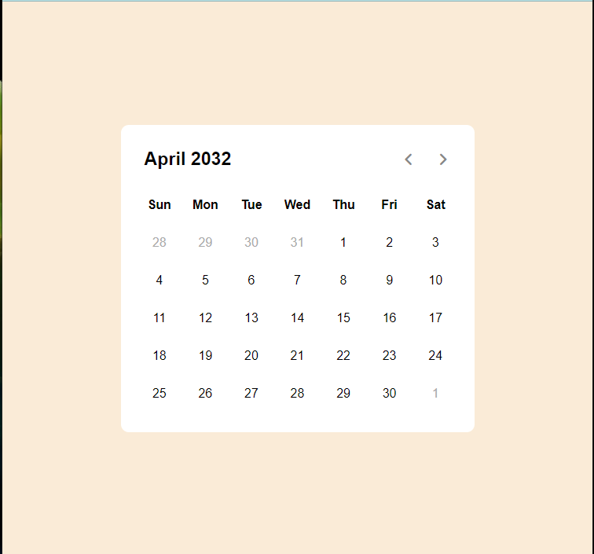

# Dynamic-Calender

## Welcome to the Calender App Repo 👋

Simple calender built with HTML, CSS, JavaScript that displays dates dynamicly.

## Concepts

You are going to learn `new Date()` constructer and its methods. And you are going to learn how to grab date's data and modify it.

## Free to clone

Feel free to clone the repo and make some changes to it.

## Demo

You can check the demo version here 👉 [Demo](https://roudi22.github.io/Dynamic-Calender/)

**HAPPY CODING 🚀**
